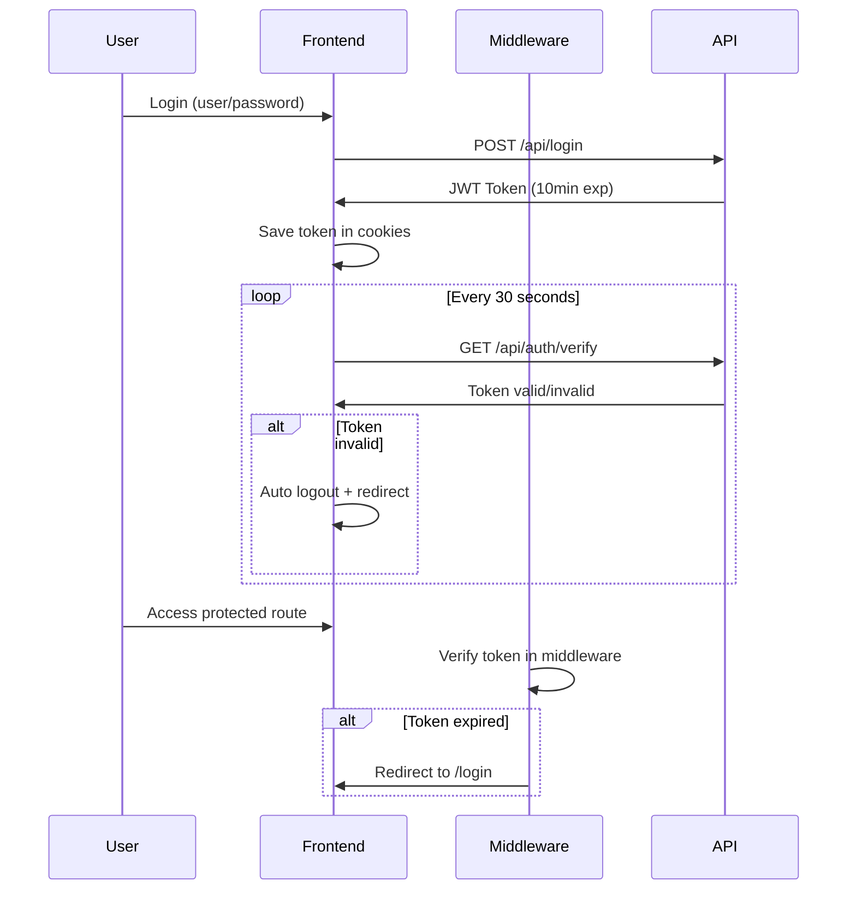

# Sistema de Gestão com Autenticação - Arquitetura Modular

Este é um sistema de gestão completo desenvolvido com Next.js 15, React Query, Tailwind CSS e TypeScript, seguindo uma **arquitetura modular por domínio**.

## 🏗️ Arquitetura Modular

A aplicação utiliza uma arquitetura modular onde cada domínio de negócio (auth, products, productions) possui sua própria estrutura completa:

```
src/
├── modules/                    # Módulos organizados por domínio
│   ├── auth/                   # Módulo de Autenticação
│   │   ├── types/              # Interfaces e tipos do auth
│   │   ├── hooks/              # Hooks React Query do auth
│   │   ├── services/           # Services API do auth
│   │   ├── contexts/           # Context providers do auth
│   │   └── index.ts            # Re-exports do módulo
│   ├── products/               # Módulo de Produtos
│   │   ├── types/              # Interfaces e tipos de produtos
│   │   ├── hooks/              # Hooks React Query de produtos
│   │   ├── services/           # Services API de produtos
│   │   └── index.ts            # Re-exports do módulo
│   ├── productions/            # Módulo de Produções
│   │   ├── types/              # Interfaces e tipos de produções
│   │   ├── hooks/              # Hooks React Query de produções
│   │   ├── services/           # Services API de produções
│   │   └── index.ts            # Re-exports do módulo
│   └── index.ts                # Re-export geral de todos os módulos
├── app/                        # Next.js App Router
├── components/                 # Componentes compartilhados
└── lib/                        # Utilitários compartilhados
```

### ✅ Vantagens da Arquitetura Modular

1. **Separação de Responsabilidades**: Cada módulo gerencia seu próprio domínio
2. **Escalabilidade**: Fácil adicionar novos módulos sem afetar os existentes
3. **Manutenibilidade**: Código organizado e fácil de encontrar
4. **Reusabilidade**: Hooks e services podem ser importados facilmente
5. **Type Safety**: TypeScript garantindo tipos consistentes por módulo

### 📦 Como Importar de Módulos

```typescript
// Importar tudo de um módulo específico
import { useAuth, LoginRequest, authService } from '@/modules/auth';
import { useProducts, Product, productService } from '@/modules/products';

// Ou importar de módulos específicos
import { useLogin } from '@/modules/auth/hooks/useAuth';
import { Product } from '@/modules/products/types';

// Ou importar tudo de uma vez
import { useAuth, useProducts, useProductions } from '@/modules';
```

## 🚀 Características Principais

### ✅ Sistema de Login
- **Usuário:** `iforth.development.test`
- **Senha:** `famosaSenha123`
- Validação de formulários com React Hook Form e Zod
- Interface moderna seguindo o wireframe
- Proteção de rotas automática

### ✅ Autenticação e Segurança com JWT
- **JWT com Expiração**: Tokens com validade de 10 minutos
- **Verificação Automática**: Verificação periódica da validade do token (a cada 30s)
- **Logout Automático**: Usuário é desconectado quando token expira
- **Middleware de Proteção**: Verificação de token em todas as rotas
- **Interceptadores HTTP**: Axios intercepta tokens expirados automaticamente
- **Endpoint de Verificação**: `/api/auth/verify` para validar tokens
- **Cookies Seguros**: Persistência segura com expiração automática

## 🔐 Segurança JWT Implementada

### **Token-Based Authentication**
- **Expiração**: Tokens JWT expiram automaticamente em 10 minutos
- **Verificação Server-side**: Middleware verifica validade em cada requisição
- **Verificação Client-side**: Context verifica token a cada 30 segundos
- **Logout Automático**: Usuário é desconectado quando token expira

### **Fluxo de Autenticação**


### **Endpoints de Segurança**
- `POST /api/login` - Gera JWT com expiração de 10 minutos
- `GET /api/auth/verify` - Verifica validade do token atual
- **Middleware Global** - Protege todas as rotas automaticamente

### **Vantagens sobre Timer Frontend**
✅ **Mais Seguro**: Token não pode ser manipulado no frontend  
✅ **Stateless**: Não depende de timers que podem falhar  
✅ **Server-side**: Validação acontece no servidor  
✅ **Automático**: Middleware intercepta requisições inválidas  
✅ **Padrão Industry**: Usa JWT, padrão da indústria  

### ✅ BFF (Backend for Frontend)
Route Handlers implementados conforme especificação:
- `POST /api/login` - Login no sistema
- `GET /api/registers/products` - Listar produtos
- `POST /api/registers/products` - Criar produto
- `PUT /api/registers/products/flag` - Alterar situação do produto
- `GET /api/records/productions` - Listar apontamentos
- `POST /api/records/productions` - Criar apontamento
- `PUT /api/records/productions/flag` - Alterar situação do apontamento

### ✅ Gestão de Produtos (Exemplo de Módulo)
- Página completa de CRUD de produtos
- Criação de novos produtos
- Ativação/desativação de produtos
- Interface responsiva com Tailwind CSS

## 🛠️ Tecnologias Utilizadas

- **Next.js 15** - Framework React com App Router
- **React Query (@tanstack/react-query)** - Gerenciamento de estado servidor
- **React Hook Form** - Formulários performáticos
- **Zod** - Validação de schemas
- **Tailwind CSS** - Estilização moderna
- **TypeScript** - Type safety
- **React Toastify** - Notificações
- **js-cookie** - Gerenciamento de cookies
- **Axios** - Cliente HTTP

## 🚀 Como Executar

1. **Instalar dependências:**
   ```bash
   npm install
   ```

2. **Executar em desenvolvimento:**
   ```bash
   npm run dev
   ```

3. **Acessar a aplicação:**
   - URL: http://localhost:3000
   - Será redirecionado automaticamente para `/login`

4. **Fazer login:**
   - Usuário: `iforth.development.test`
   - Senha: `famosaSenha123`

5. **Navegar:**
   - Dashboard: Visão geral do sistema
   - Produtos: Gestão completa de produtos (exemplo de módulo)

## � Exemplos de Uso dos Módulos

### Módulo Auth
```typescript
// Em qualquer component
import { useAuth } from '@/modules/auth';

function MyComponent() {
  const { user, login, logout, isAuthenticated } = useAuth();
  
  return (
    <div>
      {isAuthenticated ? (
        <p>Olá, {user?.name}</p>
      ) : (
        <button onClick={() => login(credentials)}>Login</button>
      )}
    </div>
  );
}
```

### Módulo Products
```typescript
// Em qualquer component
import { useProducts, useCreateProduct } from '@/modules/products';

function ProductsList() {
  const { data: products, isLoading } = useProducts();
  const createProduct = useCreateProduct();
  
  const handleCreate = (productData) => {
    createProduct.mutate(productData);
  };
  
  return (
    <div>
      {products?.map(product => (
        <div key={product.id}>{product.name}</div>
      ))}
    </div>
  );
}
```

## 🔄 Adicionando Novos Módulos

Para adicionar um novo módulo (ex: `customers`):

1. **Criar estrutura:**
   ```
   src/modules/customers/
   ├── types/index.ts
   ├── hooks/useCustomers.ts
   ├── services/customer.service.ts
   └── index.ts
   ```

2. **Definir tipos:**
   ```typescript
   // types/index.ts
   export interface Customer {
     id: string;
     name: string;
     email: string;
   }
   ```

3. **Criar service:**
   ```typescript
   // services/customer.service.ts
   import api from '@/lib/api';
   
   export const customerService = {
     getAll: () => api.get('/customers'),
     create: (data) => api.post('/customers', data),
   };
   ```

4. **Criar hooks:**
   ```typescript
   // hooks/useCustomers.ts
   import { useQuery } from '@tanstack/react-query';
   import { customerService } from '../services/customer.service';
   
   export const useCustomers = () => {
     return useQuery({
       queryKey: ['customers'],
       queryFn: customerService.getAll,
     });
   };
   ```

5. **Re-exportar:**
   ```typescript
   // index.ts
   export * from './types';
   export * from './hooks/useCustomers';
   export * from './services/customer.service';
   ```

6. **Adicionar ao módulo principal:**
   ```typescript
   // modules/index.ts
   export * from './auth';
   export * from './products';
   export * from './productions';
   export * from './customers'; // novo módulo
   ```

## �🔒 Funcionalidades de Segurança

- **Proteção de Rotas:** Middleware intercepta todas as rotas e verifica autenticação
- **Sessão Temporizada:** Logout automático após 10 minutos de inatividade
- **Interceptadores HTTP:** Axios intercepta respostas 401 e desloga automaticamente
- **Validação de Formulários:** Validação client-side e server-side
- **Tokens Seguros:** Cookies httpOnly para tokens de autenticação

Esta arquitetura modular permite um desenvolvimento escalável e organizado, facilitando a manutenção e evolução do sistema!
